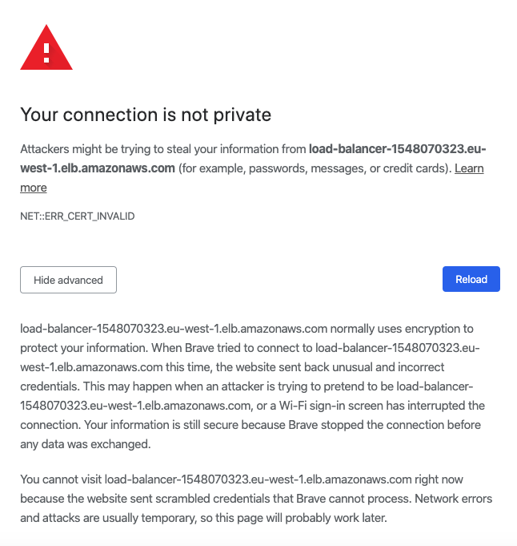
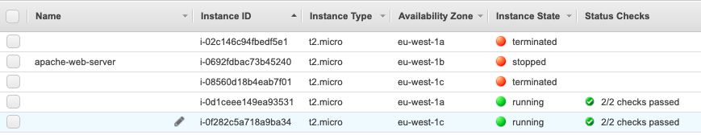
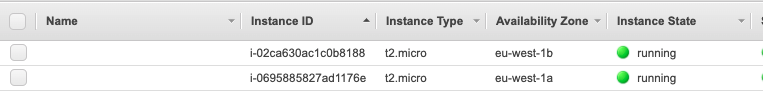

# CLOUD-COMPUTING-CLASS-2020-Lab6
## Programming your cloud infrastructure

Participant Members:
* Ishaan Dwivedi
* Anant Gupta

*Objective*: To implement and understand the working of `load balancer` along with `auto-scaling` while deploying applications on the cloud.

## Task 6.1 Bootstrap the creation of your web server

'Load balancing' refers to efficiently distributing incoming network traffic across a group of backend servers, also known as a server farm or server pool. It sits in front the servers and ensures no particular server is overworked or incase of a particular failure, traffic is re-routed to the others.

'Auto-scaling' as the name suggests is a way to automatically scale up or down the number of compute resources that are being allocated to your application based on the traffic it encounters at any given time. 

Best usage of load balancing is when used in parallel with auto-scaling, since in absence of the latter, you’ll have to know ahead of time how much capacity you need so you can keep additional instances running and registered with the load balancer to serve higher loads. 


### Questions
#### Q611. What happens when you use https://your-load-balancer-url instead of http://your-load-balancer-url ? Why does that happen? How could you fix it?
`Answer:` When trying to use the HTTPS link, the browser throws an Invalid Certificate Error (ERR_CERT_INVALID) as shown in the screenshot below. This happends due to the fact that we are using a self-generated SSL certificate that the browser uses as a means to identify a secure connection. This can be fixed by purchasing a certificate that allows the browser to assure the security of the connection.



#### Q612. Stop all three EC2 instances and wait aprox. 5 minutes. What happens? Why?
`Answer:` On stopping the 3 EC2 instances, althought the primary AMI remains stopped, the image instances created as a result of the Auto-scaling group are terminated and 2 new instances are automatically generated (screenshot below). This happens since we have an active auto-scaling group with a default desired running instances count of 2, hence the instances are recreated when we manually stop them.




#### Q613. Terminate all three EC2 instances and wait aprox. 5 minutes. What happens? Why?
`Answer:` On terminating the 3 EC2 instances, although the primary AMI terminates, the image instances created as a result of the Auto-scaling group are terminated and 2 new instances are automatically generated (screenshot below). This happens since we have an active auto-scaling group with a default desired running instances count of 2, hence the instances are recreated when we manually terminate them.



#### Q614. How are you going to end this section regarding the use of AWS resources?
`Answer:` We end the use of the AWS resources by setting the 'Terminated processes' option to Terminate in the Auto-scaling group, which allows us to manually terminate the image AMIs without them being recreated by the auto-scaling group.

#### Q615. Create a piece of code (Python or bash) to reproduce the above steps required to launch a new set of web servers with a load balancer. Start using the AMI that you have already created.
`Answer:`
```
conn_elb.create_load_balancer(LoadBalancerName=elastic_load_balancer['name'],
                                    AvailabilityZones=zoneStrings,
                                       Listeners=elastic_load_balancer['connection_forwarding'],
                                       SecurityGroups=['load-balancer-sg']
                                       Tags=[{'Project':'ccbda bootstrap','Cost-center':'laboratory'}])
```


## Task 6.2: Serverless example

### Questions
#### Q621. What is the list of events that the above URL triggers?
`Answer:` The URL loads the index.html file and invokes the 'Loading function' of the lambda function associated with the API gateway.

#### Q622. Does the reply of the above URL match what it should be expected? Why?
`Answer:` Yes, the reply of the URL matches the expectation as defined. The index.html file determines its layout on the front-end and the associated lambda function establishes the connection with the Dynamo DB at the back-end.

#### Q623. Explain what happens (actions and parts activated) when you type the URL in your browser to obtain the page updated with the shopping list.
`Answer:` This invokes the GET Item API gateway call to the Dynamo DB at the backend and pulls the contents of the shopping-list DB to the browser in the format defined by the script.js file.

#### Q624. Explain what happens (actions and parts activated) when you type a new item in the New Thing box.
`Answer:` On clicking the 'add someThing else' button, the POST Item API gateway call is invoked to the Dynamo DB at the backend and the contents of the text box in the browser are fetched and added as a new item in the shopping-list DB as defined by the script.js file.

#### Q625. Have you been able to debug the code of the Lambda function? If the answer is yes, check that you are using the root API keys. Erase such keys and create a new testing user with the required permissions.
`Answer:`

#### Q626. What are the minimum permissions that the user's API keys needs to execute the Lambda function locally?
`Answer:`

#### Q627. Create a piece of code (Python or bash) to reproduce the above steps required to launch a new AWS Lambda function and AWS API gateway.
`Answer:`
